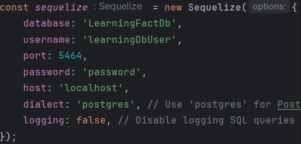
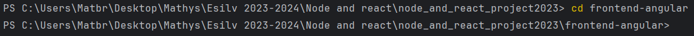
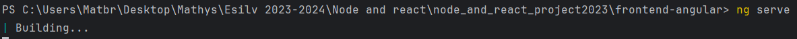
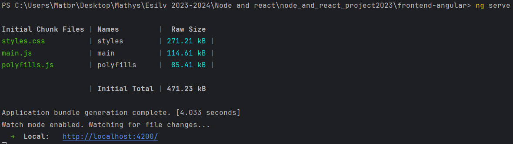
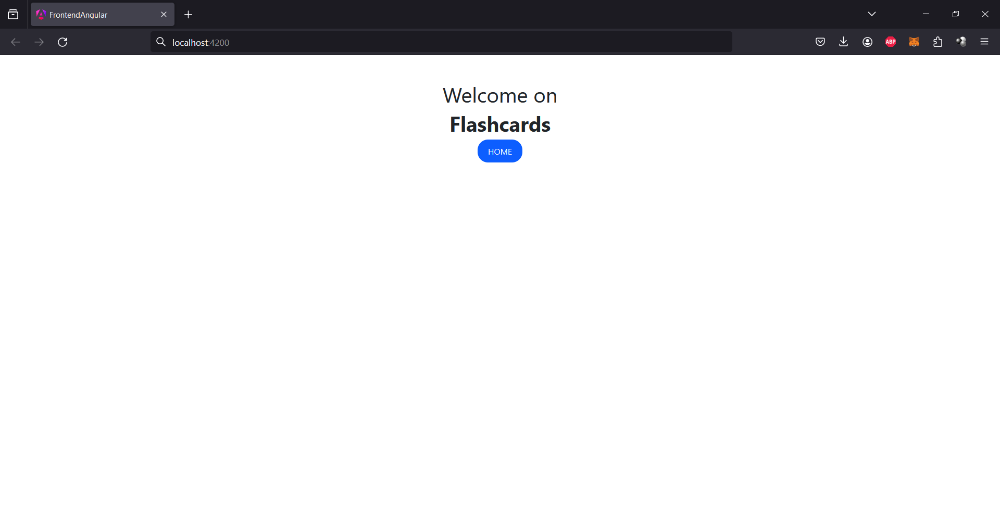
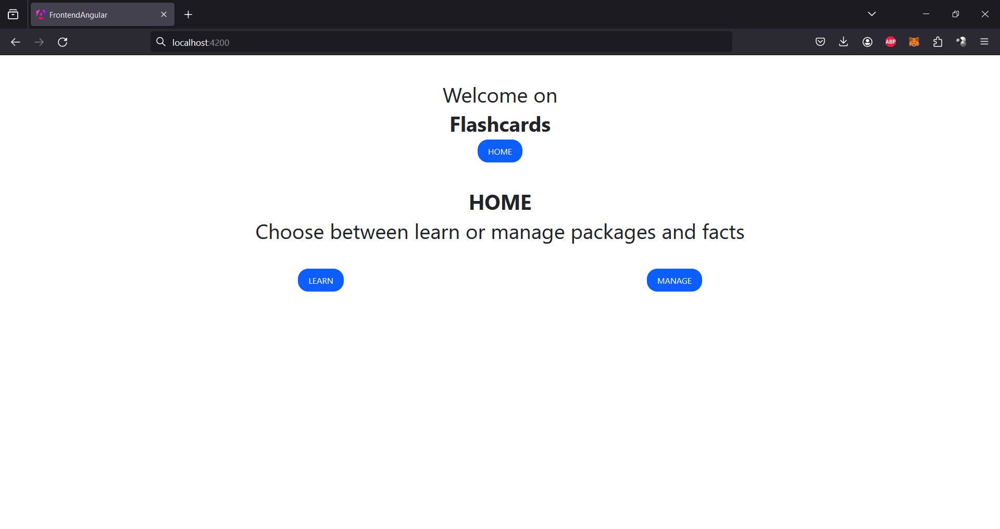

This file is here to teach you How to host the website step by step.

First of all, you need to create a PostgreSQL user that have create, select and modify rights.

After you created the user, you need to open the <u>**"sequelize.ts"**</u> file and <u>**modify**</u> it with the different informations :

Once you filled the file <u>(**!make sure the _port_ you entered is right!**)</u>, you need to <u>**run the "syncTables.js"**</u> file. It will create the tables and populate them with 4 LearningPackages and 4 LearningFacts by LearningPackage (16 Facts in total)

You then need to <u>**run the "app.js"**</u> file (with the command "node app.js" or by clicking the run button in webstorm) to launch the backend side of the project. (backend launched on localhost:3000)

You can now go into your terminal, **change the directory** to "\frontend-angular" (cd "directory to \node_and_react_project2023\frontend-angular"):

and then run the command "ng serve"

The server should now be running, just click on the link or type "localhost:4200" into your navigator:

then click the "HOME" button and you can use the website

The <u>**advanced web feature**</u> is at the end of any learning program, it displays the results of your training session on a package.

From here, using the website is easy and intuitive. I let you try it by yourself, **please try every functionality, it took us a lot of time**.

Thanks !