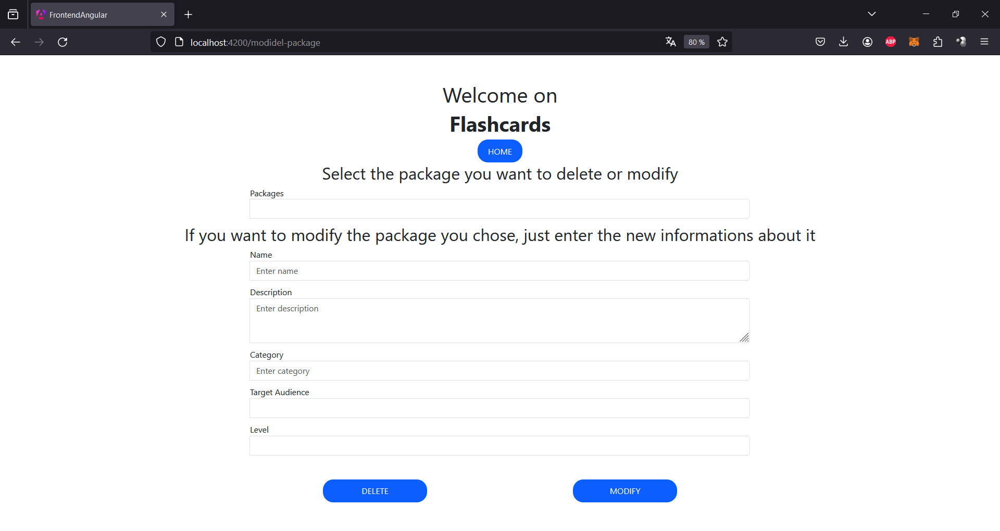

Here is all you can do in the application:
- create new packages
- create new facts
- modify existing facts
- modify existing packages
- delete existing facts
- delete existing packages (this will delete all the facts inside the package before deleting the package)
- answer the questions of the facts in a given package
- rate how well you answered each question (at the end of the learning session, you will get a review telling how well you performed)

And everytime you do something, there are always verifications. For example, if you want to create a new fact, you can't leave an empty question or answer. I let you try everything by yourself.

Now, here are all the screens of the application:

Home screen, to navigate through the application:

Manage screen, to navigate through the manage section:

Manage facts screen, to choose between creating or editing/deleting a fact:

Create fact screen, screen used to create a new learning fact:

Delete/modify fact screen, used to create or modify an existing fact:

Manage packages screen, to choose between creating or editing/deleting a package:

Create package screen, screen used to create a new learning package:

Delete/modify package screen, used to create or modify an existing package:

Learn screen, choose a package to train on:

Training screen, displays questions from the chosen package in a random order:

Results screen, display the result of the training session (of course I have said I missAnswered some questions only to have a beautiful chart):

Here are all the screens of the application.

Thanks for reading